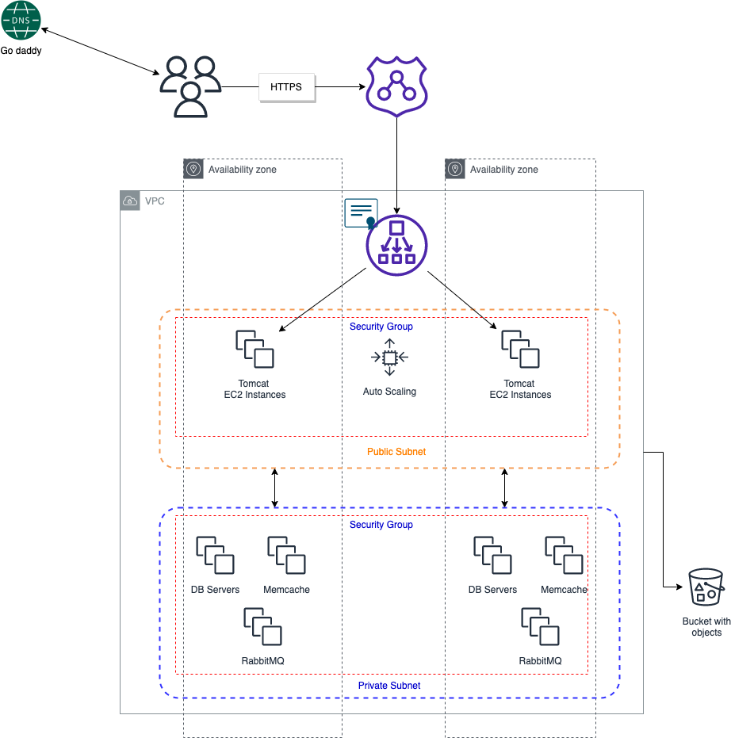

# Plezi Web Application 

## Taking an on-premise app to the AWS cloud

## Scenario

Plezi Inc. is a fictitious start-up that sells online women clothes. Currently the company application is hosting on-premise on virtual and physical servers. The application makes use of a number of services. Some of the services include database, MQ, web server, memory-caching system, DNS, and many more. To control cost and reduces complexities, the company makes the decision to migrate the application to the cloud.

## Problem

Managing all those application services, Plezi needs multiple teams working around the clock. That would include virtualization, Data Center Operations, Monitoring, and System Administrators teams. It is currently costing the company lots money to maintain all those teams. Also most of the daily activities are done manually with very little automation. If Plezi decides to scale up and/or down, it will not be easy. 

## The solution

The solution to these problems is for Plezi to implement a cloud setup. To reduce cost the company will take advantage of pay-as-You-Go payment model. It would make managing the infrastructure easier and more flexible. 

## AWS Services

In this project we are making use of a number of AWS web services.

**EC2 Instances** to host the Tomcat web server, RabbitMQ, Memcached, and MySql
**Elastic Load Balanace** will replace the NIGNX Load Balancer
**Autoscaling** to automate EC2 scaling
**S3/EFS Storage** to host the application WAR file and logs
**Route 53** for private DNS service 
**IAM** for creating a user with programmatic access for the application
**Certificate Manager** create a certificate for HTTP services

## Our objective
- Plezi wants a flexible infrastructure
- Plezi wants no upfront cost
- PLezi wants to modernize the application more effectively by using AWS services
- Plezi wants automation or Infrastructure as Code

## The application Infrastructure
--
